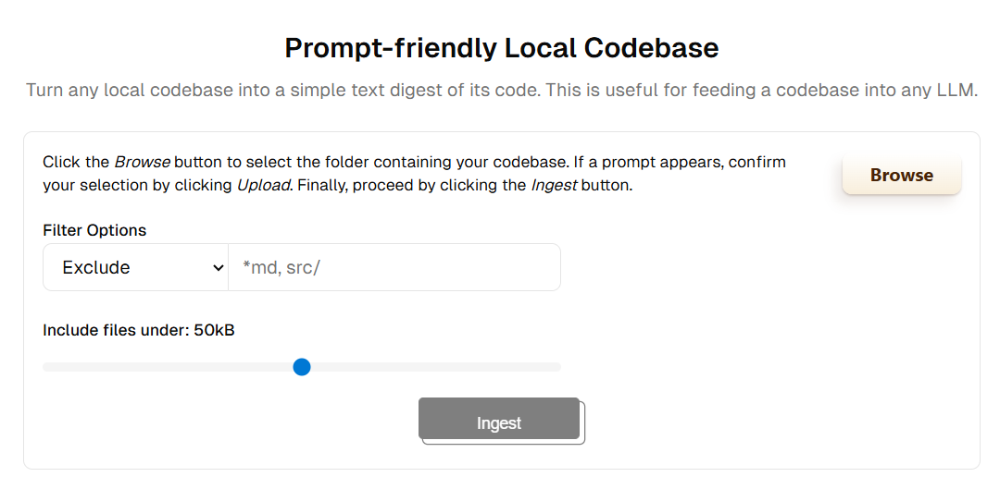
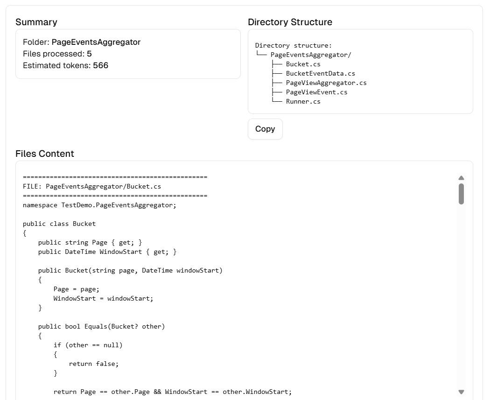

# Prompt-friendly Local Codebase

A Next.js web application that allows you to turn any local codebase into a simplified, prompt-friendly digest.
This is useful for preparing a project’s source code for analysis with Large Language Models (LLMs).
Inspired by [Gitingest](https://gitingest.com/).
   
✨ Features

📂 Upload a local folder — Select your project’s codebase directly.

⚙️ Filter options — Exclude/include files or directories using patterns (e.g. *.md, src/).

📏 File size limit — Only include files under a configurable size (default: 50 kB).

🔄 Ingest button — Generate a lightweight digest of your codebase.
   
🚀 Getting Started

Prerequisites

- Node.js
- npm or yarn
  

Running the Development Server: npm run dev

Building for Production: 
- npm run build
- npm start

